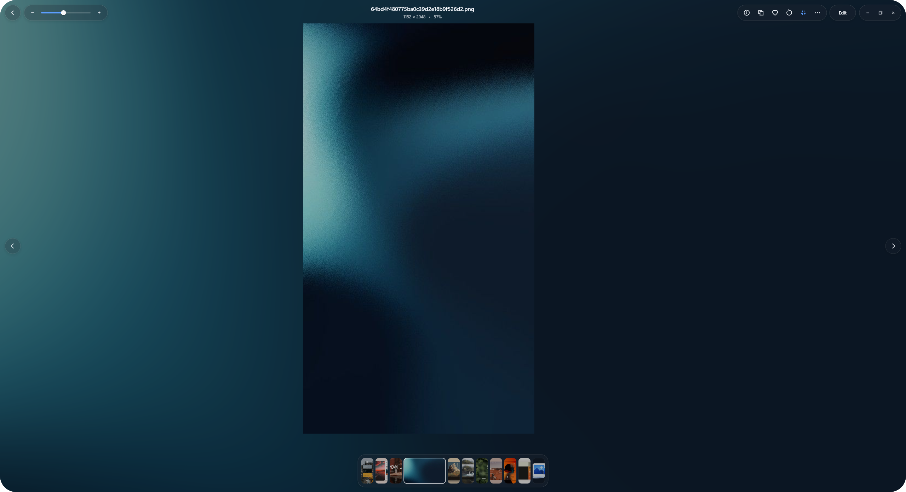

<div align="center">


# VetroLook

### A fast, native and beautifully minimal image viewer for Windows.

**Instant viewing. Smart photo library. Fluid interactions. No cloud required.**

<br>

[](#)
[](#)
[](LICENSE)
[](#development-status)

<br>



</div>

---

## What is VetroLook?

**VetroLook** is a native Windows image viewer and photo library built around one simple idea:

> Viewing an image should feel instant.

Windows already has powerful hardware, codecs and graphics APIs, yet opening a photo often still feels slower and heavier than it should.

VetroLook aims to combine:

- the immediacy of **Quick Look**
- the simplicity and polish of **macOS Photos / Preview**
- the speed of classic native Windows viewers
- a modern photo library that works directly with your existing folders

without requiring you to import your collection into a proprietary database or upload anything to the cloud.

---

## ✦ Designed around the image

VetroLook avoids traditional Windows toolbars, giant menus and heavy application chrome.

The interface floats directly above the image using a soft, matte glass visual language.

<div align="center">


</div>

### The viewer includes

- smooth zoom and pan
- Fit / 1:1 switching
- instant folder navigation
- floating filmstrip gallery
- copy to clipboard
- favorites
- rotation
- lightweight editing tools
- file operations
- image information
- EXIF metadata
- RGB / luma histogram with highlight/shadow clipping analysis
- GPS location, with a direct link to open it in Maps
- dark and light appearance

Every interaction is designed around subtle physical motion:

- springs
- inertia
- compressed press states
- elastic gallery movement
- shared-element transitions
- GPU-driven transforms

The goal is not simply to make VetroLook *look* modern.

It should **feel physical**.

---

## ⌨ Quick preview

VetroLook is designed to work naturally with Windows Explorer. Select an image, press **Space**, and it opens instantly in place — the same idea as macOS Quick Look.

This relies on a background instance staying alive to catch the key from anywhere in Explorer, so it is a toggle ("Open with Space") rather than something silently forced on; turning it on registers VetroLook to start with Windows.

Opening a file directly (double-click, "Open with", or Quick Preview) still keeps the full navigation model — Back always makes sense, even though the app was never actually browsed into that state:

```text
Explorer
   ↓
Viewer
   ↓ Back
Parent folder
   ↓ Back
Global library
```

No disconnected viewer window. No losing context.

## Smart Library

VetroLook can build a photo library directly from the images already present on your computer. There is no import process and the files stay exactly where they are.

On first launch VetroLook indexes supported images and groups them by their real filesystem locations. Afterwards the library is maintained incrementally instead of repeatedly crawling every directory: a background watcher picks up changes while the app runs, and a cheap re-check at startup catches anything that happened while it was closed.

### NTFS indexing architecture

```text
NTFS
 │
 ├── MFT / FSCTL_ENUM_USN_DATA          (fast path, needs elevation)
 │          ↓
 │    initial file index
 │
 └── USN Change Journal                 (fast path, catch-up after being closed)
            ↓
      incremental updates
            ↓
       VetroLook Index
```

Opening a raw volume handle for the fast path needs elevated privileges — a Windows restriction, not a choice VetroLook makes. Without it, VetroLook transparently falls back to an ordinary recursive directory scan plus live change notifications, so normal, non-admin use is never blocked; it's simply a slower way to reach the same index.

Every indexed file and folder gets an identity independent of its path: on NTFS this is the volume serial number plus the file's own NTFS file ID, so renaming or moving a file never loses its place in the library.

## Folder View

Instead of inventing fake AI categories such as Food, People or Travel, VetroLook starts with something deterministic: your actual filesystem.

```text
Downloads
Pictures
DCIM
project_n
renders
assets
Screenshots
RAW
...
```

Folders containing supported images automatically appear in the library. Folder cards look like folders — a tab and body, not a flat photo stack — with a handful of the photos inside them fanned out and tucked into the opening.

<div align="center">


</div>

### Folder Families

Real filesystems can become messy:

```text
project_n/
├── assets/
├── renders/
└── output/
```

When several sibling folders share a common, generic name (`assets`, `renders`, `output`, `screenshots`, and similar), VetroLook already groups them into one virtual family in the library — without moving a single file:

```text
project_n
1,284 photos · 3 locations
```

A family can be split back into its separate folders per-folder, and the choice is remembered. Grouping by capture-time range, camera metadata or visual similarity — for folders that don't happen to share a generic name — is not implemented yet.

## Photos View

Folders are only one way to browse a photo collection. Switch to Photos View to ignore folder boundaries and browse every indexed photo as one flat, virtualized grid — searchable, sortable and filterable the same way as the folder view. Photos are grouped by their local date into a day-by-day timeline.

## Photo Stacks

A single photograph may exist as multiple files:

```text
IMG_3381.NEF
IMG_3381.JPG
IMG_3381_edit.JPG
```

VetroLook already collapses these into a single stack in the grid when it's confident about the relationship — same folder, same filename stem, and either a RAW+JPEG pair or a plain+edited pair. It deliberately stays conservative: files it isn't sure about are left separate rather than guessing. This uses filenames and folder structure only, no machine-learning model.

Automatically detecting bursts (several near-identical shots taken seconds apart) or near-duplicate/similar photos is planned but not implemented yet.

## Image Information

The floating Info panel provides technical information without covering the image with permanent UI.

<div align="center">


</div>

Available information includes:

**File** — filename, format, dimensions, orientation, DPI, file size, full path (copy to clipboard), transparency, HDR/SDR, JPEG encoding type.

**Camera** (when EXIF is available) — camera, lens, focal length, aperture, shutter speed, ISO, and more.

**Location** (when GPS EXIF is available) — coordinates, with a direct "Open in Maps" link.

**Analysis** — RGB and luminance histogram, with a live hover readout of the exact channel values under the cursor, plus highlight/shadow clipping shown as real toggles with an inline percentage that can also overlay the clipped regions directly on the photo.

Sections that would be empty or meaningless for a given file (no EXIF, no GPS) are simply not shown.

Heavy metadata and histogram work happens off the UI thread, so opening the panel never stalls the viewer.

## Supported formats

VetroLook is built around a modular decoder pipeline.

**Standard images:** JPEG, PNG, GIF, BMP, TIFF, ICO

**Modern formats:** WebP, AVIF, HEIC / HEIF

**Camera RAW** (via LibRaw): CR2, CR3, NEF, ARW, DNG, RAF, RW2, ORF, PEF, and other LibRaw-supported formats

**Professional / HDR:** OpenEXR (tone-mapped for display)

JPEG XL is not supported yet.

## Native performance

VetroLook deliberately avoids heavyweight browser-based UI frameworks. The application is built around native Windows technologies and native image libraries.

```text
VetroLook
│
├── Win32
├── Direct2D
├── DirectComposition
├── DirectWrite
├── WIC
│
├── libjpeg-turbo
├── Wuffs
├── libwebp
├── libavif
├── dav1d
├── LibRaw
└── TinyEXR
```

Performance principles:

- asynchronous image decoding, off the UI thread
- thumbnail-size decoding instead of unnecessary full-resolution loads
- prefetching adjacent images for instant next/previous
- cancellation of obsolete decode jobs when you move on before they finish
- a virtualized grid — only the folders/photos actually on screen ever get a bitmap
- bounded in-memory caches
- GPU composition for interface animations

A disk-persistent thumbnail cache (surviving app restarts, with size-bucketed entries and LRU eviction) is planned; today's thumbnail cache is in-memory only and rebuilds each session.

## Motion system

Navigation in VetroLook is spatial rather than page-based.

**Folder → Photos** — the folder card compresses and its visible preview thumbnails physically fly out into their positions in the new photo grid, with a slight stagger, while the rest of the screen cross-fades.

```text
Folder
  ↓
photos rise out
  ↓
shared-element transition
  ↓
Photo Grid
```

**Photo → Viewer** — the clicked thumbnail becomes the viewer image: its cached preview stands in immediately while the full-resolution decode happens in parallel and crossfades in seamlessly.

```text
Thumbnail
    ↓
position + scale + radius morph
    ↓
Viewer
```

Closing performs the transition in reverse, landing back on the exact thumbnail it came from (auto-scrolling the grid into view first if needed). The intention is that you perceive the same object changing state, not one screen replacing another.

## Drag & Drop

VetroLook supports native Windows OLE drag-and-drop. Photos can be dragged directly from the library into other applications.

```text
VetroLook
   ↓
IDataObject / CF_HDROP
   ↓
Explorer / editor / upload target
```

The real underlying file is transferred, not a rendered bitmap copy.

## Privacy

VetroLook is a local-first application. Your photo library does not need to be uploaded anywhere — indexing, thumbnails, metadata and search all run directly against your local files.

## Development status

VetroLook is under active development.

**Implemented**

- Native image viewer with the format set listed above
- Zoom / pan, Fit / 1:1
- Floating viewer controls with idle auto-hide
- Image Info panel, histogram with clipping analysis, GPS → Maps link
- Folder library with persistent, incrementally-updated indexing
- NTFS MFT/USN fast-path indexing (elevated), with an automatic non-admin fallback
- Stable file identity independent of path (NTFS file ID based)
- Search, filtering and sorting across both folder and photo views
- Folder Families (generic sibling-name grouping)
- Photo Stacks (RAW/JPEG and edit/plain grouping)
- Real shared-element transitions, both Folder→Photos and Photo→Viewer
- Native OLE drag-and-drop (CF_HDROP)
- Direct-file navigation context (Explorer → Viewer → folder → library, synthesized when needed)
- Quick Look-style Space preview from Explorer
- Standalone installer and uninstaller

**In progress**

- Disk-persistent thumbnail cache (currently in-memory only)
- Date-based timeline for Photos View
- Event and burst detection
- Similar/near-duplicate photo detection
- Broader Folder-Family signals beyond generic sibling names
- JPEG XL decoding
- Further indexing and performance hardening

## Building

Typical requirements:

```text
Windows 10 / 11
Visual Studio 2022 (MSVC, C++20)
CMake 3.25+
Windows SDK
Git
```

Clone and configure:

```bash
git clone https://github.com/Phnem/VetroLook.git
cd VetroLook
cmake -S . -B build -G "Visual Studio 17 2022" -A x64
```

Build:

```bash
cmake --build build --config Release --target VetroLook
```

The resulting `VetroLook.exe` is written to `dist/`. Build commands may change while the project is under active development — check `CMakeLists.txt` for the current target names.

## Project philosophy

VetroLook follows a few strict principles.

**01 — Fast first.** A photo viewer should never make the user wait unnecessarily.

**02 — Files stay yours.** The filesystem remains the source of truth.

**03 — No forced cloud.** Photo management should not require uploading your collection.

**04 — No heavyweight AI dependency.** Metadata, filesystem structure and lightweight heuristics should solve a problem before machine learning is introduced.

**05 — Motion has meaning.** Animations communicate where objects came from and where they are going.

**06 — UI stays out of the way.** The photo is always the most important element on screen.

## Why the name VetroLook?

*Vetro* — glass. The name reflects the interface language of the project: translucent, floating surfaces surrounding the content without competing with it.

*Look* — exactly what the application is built for. Open. Look. Move on.

## Acknowledgements

VetroLook uses and learns from excellent open-source projects and libraries including:

- QuickView
- QuickLook
- libjpeg-turbo
- Wuffs
- libwebp
- libavif
- dav1d
- LibRaw
- TinyEXR

Their respective licenses and copyright notices remain applicable. See the repository's third-party notices for details.

VetroLook is inspired by interaction concepts found in products such as macOS Quick Look, Preview and Photos, but is not affiliated with Apple.

## License

VetroLook is distributed under the GNU General Public License v3.0. See `LICENSE` for the full license text. Some bundled or referenced third-party components are distributed under their own, compatible licenses.

---

<div align="center">

**VetroLook**
Your photos. Your files. Instantly.
Made for Windows.

</div>
