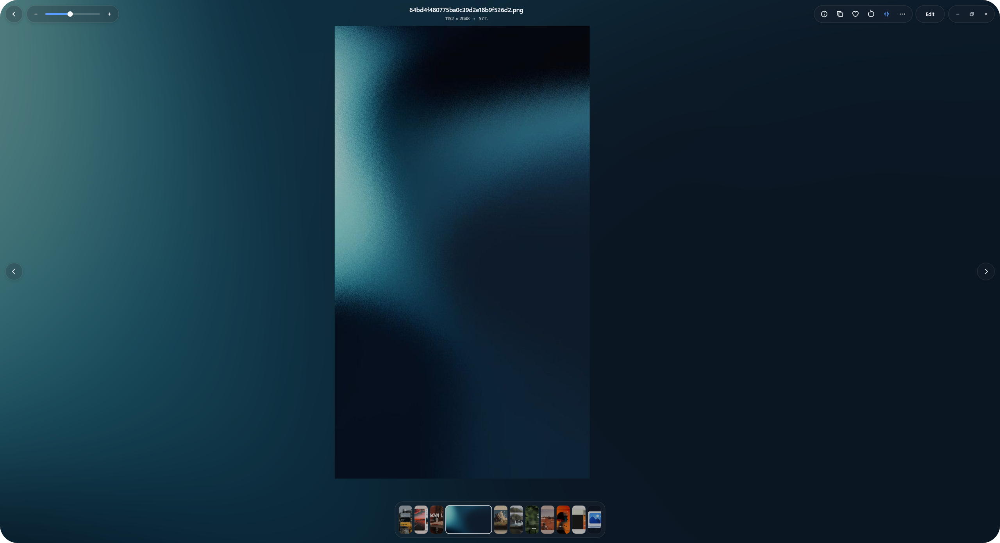

<div align="center">


# VetroLook

### A fast, native and beautifully minimal photo and video viewer for Windows.

**Instant photos. Smooth films. Subtitles made on your own PC. No cloud required.**

<br>

[](#)
[](#)
[](LICENSE)
[](https://github.com/Phnem/VetroLook/releases/latest)

<br>



</div>

---

## What is VetroLook?

**VetroLook** is a native Windows viewer for photos and films, built around one idea:

> Opening a file should feel instant — and whatever it is, it should open in the same calm window.

A photograph and a film are two modes of one viewer. The window, the glass
interface, the folder navigation and the keyboard stay the same; what changes
is what the content needs. There is no separate player, no import step, no
account and no upload.

VetroLook aims to combine:

- the immediacy of **Quick Look**
- the polish of **macOS Photos / Preview**
- the playback quality of **mpv**
- the speed of classic native Windows viewers

## What's new in 2.1

2.1 turns VetroLook into a video player without making it a heavier photo viewer.

- **Video Mode** — films play in the same window, composited underneath the glass interface, with hardware decoding, display-synced pacing and HDR output.
- **Timeline previews** — hover the timeline and the frame you are heading for appears above it, from a second decoder that never disturbs playback.
- **Frame-accurate stepping** — one frame forward or back with `,` and `.`.
- **Subtitles in the Vetro Bubble** — plain dialogue is drawn on frosted glass that morphs between lines; authored typesetting stays exactly as its author placed it.
- **AI subtitles, generated locally** — Whisper transcribes the film's speech on your own machine, minutes ahead of where you are.
- **Streams** — direct links, HLS and DASH, live streams with a DVR window, and reconnecting after a dropped connection.
- **RTX Video Super Resolution** — on NVIDIA RTX cards, films shown larger than their resolution are upscaled by the driver.
- **Picture in picture, Windows media controls, resume, chapters, A-B loop, screenshots** — and a session that comes back after an unexpected exit.

The full list is in [CHANGELOG.md](CHANGELOG.md).

---

## ✦ Designed around the content

VetroLook avoids traditional toolbars, giant menus and heavy application chrome.
The interface floats above the photo or the film as soft, matte glass — and over
a film that glass is the film itself, blurred live by the Windows compositor.

Every interaction is designed around subtle physical motion: springs, inertia,
compressed press states, shared-element transitions and GPU-driven transforms.
Controls collapse into the point they stand on when they leave, rather than
simply fading out.

The goal is not simply to make VetroLook *look* modern. It should **feel physical**.

---

## 🎬 Video Mode

### Playback

- libmpv as the playback engine, rendering through `gpu-next` into VetroLook's own DirectComposition tree — no second window, no foreign controls
- hardware decoding where the GPU supports the codec (H.264, HEVC, VP9, AV1 and more), software otherwise
- frame pacing matched to the display: exact refresh rates, display-resampled playback where the cadence allows it
- HDR output on HDR displays, tone mapping on SDR ones, wide-gamut handling
- a **Resource Governor** that protects the picture first: previews, background indexing, AI work and even the glass blur give way before a frame is dropped

Measured on a 1080p/24 fps film (RTX 3060 Ti, 180 Hz display): 24.00 fps shown,
0 dropped, 0 late, audio/video offset 0.001 s.

### Navigation

- hover the timeline for live frame previews (first frame about 50 ms, then about 26 ms per new position on a 1080p film)
- `,` / `.` step one frame back or forward, exactly
- chapters with `PageUp` / `PageDown`
- the next film in the folder follows automatically

### Subtitles

- embedded and sidecar subtitles (`film.srt`, `film.ru.srt`, `Subs/` folders) load automatically
- each cue is classified: plain dialogue goes to the **Vetro Bubble**, while positioned signs, karaoke, rotation and bitmap subtitles (PGS, VobSub) are left to libass, untouched
- the bubble holds its shape through the ordinary pauses of a conversation and collapses into a point after a real silence
- subtitle and audio delay, remembered per film

### AI subtitles

Films without subtitles can get them from **Whisper**, running entirely on your computer.

- open the **…** menu and choose **AI subtitles · Download** once (about 1.2 GB): the whisper.cpp runtime, the Silero speech detector and the large-v3-turbo model are fetched from their official sources, checked against their published SHA-256 and stored in `%LOCALAPPDATA%\VetroLook`
- press `A` during a film: speech is transcribed a few minutes ahead of the playhead and shown in the same bubble as ordinary subtitles
- silence is never sent to the model, and lines a model tends to invent (subtitle credits, looping phrases, doubtful words over non-speech) are filtered out
- transcripts are kept, so a film opens with its subtitles ready next time; `Shift+A` saves them beside the film as `film.<language>.ai.srt`
- **Skip silence** (Gentle / Aggressive) for lectures and recordings
- transcription waits whenever playback needs the machine

On an RTX 3060 Ti a minute of audio is transcribed in about 1.5 seconds, with no late frames in the film.
**Audio never leaves your device.** None of this is included in the installers.

### Streams

- open a direct link, an HLS or a DASH address from the command line or with `Ctrl+V`
- live streams show **LIVE** instead of a length; the timeline is the window kept since joining, and `End` returns to the live edge
- a dropped connection is reopened with backoff (1, 2, 4, 8, 16 s, then every 30 s) at the position it had reached
- failures are explained in a sentence — address gone, access refused, certificate not trusted, DRM-protected service
- links to web pages work when `yt-dlp.exe` is placed in a `resolver` folder beside VetroLook; it runs out of process with a time and memory limit, and is not included

### Enhancement and windows

- **RTX Video Super Resolution** (Off / Auto / On): Auto upscales only a real enlargement, on mains power, never inside a small picture-in-picture window
- **Picture in picture** (`P`): the same window, small and on top; it remembers its place per monitor arrangement, settles into corners and pins with `T`
- the film appears in the **Windows media controls** — lock screen, volume overlay and the keyboard's media keys
- films reopen where you left them; after an unexpected exit, the next start brings the film back

---

## 🖼 Photos

### The viewer

- smooth zoom and pan, Fit / 1:1
- instant folder navigation and a floating filmstrip
- rotation, crop and lightweight drawing tools
- copy, favourites and file operations
- image information with EXIF, lens data and GPS with a link to Maps
- RGB / luma histogram with highlight and shadow clipping analysis
- dark and light appearance

Measured in 2.1 on the bundled test images: median next/previous photo in about
5.6 ms, no transition slower than 16 ms across 414 steps.

### Quick preview

Select an image in Explorer and press **Space** — VetroLook opens it in place,
the same idea as macOS Quick Look. Opening a file directly keeps the full
navigation model: Back goes to the parent folder, then to the library.

### Smart Library

VetroLook builds a photo library from the images already on your computer.
There is no import and the files stay where they are.

- folders containing images appear automatically, as real folder cards
- **Folder Families** group generic sibling folders (`assets`, `renders`, `output`) without moving a file
- **Photos View** browses every indexed photo as one searchable, sortable grid
- **Photo Stacks** collapse RAW+JPEG and edited copies conservatively
- NTFS MFT/USN fast-path indexing when elevated, with an automatic non-admin fallback, and stable file identity independent of the path

### Supported formats

**Photos:** JPEG, PNG, BMP, TIFF, ICO, GIF (first frame), WebP, AVIF, HEIC/HEIF,
PSD, PSB, OpenEXR, and camera RAW via LibRaw (CR2, CR3, NEF, ARW, DNG, RAF, RW2,
ORF, PEF and more).

**Films and audio:** MP4, MKV, MOV, WebM, AVI, TS/M2TS, WMV, FLV, OGV, 3GP and
more, plus MP3, FLAC, AAC, WAV, Opus and other audio formats — decoded by libmpv.

JPEG XL is not supported yet.

---

## ⌨ Keyboard

| Key | Photos | Films |
| --- | --- | --- |
| `Space` | Quick preview (from Explorer) | Play / pause |
| `←` `→` | Previous / next file | Seek 5 or 10 s |
| `Ctrl` + `←` `→` | — | Previous / next file |
| `,` `.` | — | One frame back / forward |
| `PageUp` `PageDown` | — | Chapters |
| `Z` / `Shift+Z` | — | Subtitle delay |
| `X` / `Shift+X` | — | Audio delay |
| `A` / `Shift+A` | — | AI subtitles / save them |
| `S` | — | Save the frame |
| `L` | — | A-B loop |
| `P` / `T` | — | Picture in picture / pin it |
| `End` | — | Back to live |
| `Ctrl+V` | — | Open an address from the clipboard |
| `R` / `Shift+R` | Rotate | — |
| `0` / `1` | Fit / 100 % | — |
| `Ctrl+O` | Open | Open |

---

## Download

Get the latest release from [Releases](https://github.com/Phnem/VetroLook/releases/latest):

- `VetroLook-<version>-Setup.exe` — standard installer
- `VetroLook-<version>-x64.msi` — Windows Installer package
- `VetroLook-<version>-Portable.zip` — no installation
- `SHA256SUMS.txt` — checksums for every download

Windows 10 / 11 x64. An NVIDIA GPU is recommended for AI subtitles and required for RTX Video Super Resolution.

## Native performance

VetroLook deliberately avoids browser-based UI frameworks.

```text
VetroLook
│
├── Win32 · Direct3D 11 · Direct2D · DirectComposition · DirectWrite · WIC
│
├── Photos:  libjpeg-turbo · Wuffs · libwebp · libavif · dav1d · LibRaw · TinyEXR · Exiv2
├── Films:   libmpv (loaded at run time, only when a film is opened)
└── AI:      whisper.cpp (downloaded on request, loaded only when used)
```

- decoding, metadata, previews and transcription all run off the UI thread
- opening a photograph never loads the playback engine or the AI runtime
- every queue and cache is bounded by what the machine actually has
- generations everywhere: work started for a file or a position you have left never comes back as current

### Benchmarks from 1.1

Windows x64 GUI measurements on the same machine and image fixtures, taken for
the 1.1 release. Lower is better.

| App | First photo after cold start | Open a camera RAW file |
| --- | ---: | ---: |
| **VetroLook** | **641 ms** | **637 ms** |
| Windows Photos | 1,079 ms | 939 ms |
| ImageGlass | 1,358 ms | 790 ms |
| ACDSee Free | 3,342 ms | 3,322 ms |
| FastRawViewer | 1,810 ms | 1,801 ms |

| Scenario | VetroLook | ACDSee Free | FastRawViewer |
| --- | ---: | ---: | ---: |
| Next standard photo | **14.9 ms** | 74.5 ms | 72.4 ms |
| Random standard photos | **18.4 ms** | 61.2 ms | 72.6 ms |
| Next camera RAW | **15.3 ms** | 61.1 ms | 85.3 ms |
| Random camera RAW | **14.8 ms** | 61.7 ms | 79.5 ms |
| Switch between formats | **15.5 ms** | 72.6 ms | 73.4 ms |

## Privacy

VetroLook is local-first. Your library, thumbnails, metadata, search, resume
positions and AI transcripts stay on your computer. AI subtitles run on your own
hardware; the only network access they need is the one-time download you start
yourself. Streams are fetched only when you open them.

## Development status

**Implemented**

- photo viewer with the formats above, info panel, histogram, GPS
- folder library with persistent, incrementally updated indexing, Folder Families, Photo Stacks, Photos View
- shared-element transitions, drag and drop, Explorer Space preview
- Video Mode with libmpv composition, hardware decode, frame pacing, HDR
- timeline previews, frame stepping, chapters, resume, A-B loop, screenshots
- subtitle classification, Vetro Bubble, sidecar subtitles
- AI subtitles with Whisper, speech detection, silence skip, export
- direct, HLS, DASH and live streams, reconnect, page resolver interface
- RTX Video Super Resolution, picture in picture, Windows media controls, session restore
- Inno Setup, MSI and portable packages

**Planned**

- disk-persistent thumbnail cache and date-based timeline
- burst and near-duplicate detection
- JPEG XL
- screen reader support through UI Automation
- a speech activity strip on the timeline

## Building

Requirements:

```text
Windows 10 / 11
Visual Studio 2022 (MSVC, C++20) with CMake
Windows SDK
Python 3 (build.ps1 installs meson and ninja for dav1d)
7-Zip (to unpack the pinned libmpv package)
Git
```

Build everything, including the dav1d and libmpv dependencies:

```powershell
git clone https://github.com/Phnem/VetroLook.git
cd VetroLook
.\build.ps1
```

`build.ps1` builds dav1d, fetches NASM for libjpeg-turbo's SIMD code, fetches
the pinned libmpv development package (`tools/fetch-mpv.ps1`, SHA-256 checked),
then configures and builds `VetroLook.exe`. The executable and `libmpv-2.dll`
are written to `dist/`.

Tests are separate targets, for example:

```powershell
cmake --build build --config Release --target VetroMediaTests VetroQualityTests VetroTranscriptTests VetroEnhanceTests
```

Release packages:

```powershell
.\build-packages.ps1 -SkipAppBuild -SkipMsix
```

The implementation history of Video Mode, stage by stage, is in [docs/STAGES.md](docs/STAGES.md).

## Project philosophy

**01 — Fast first.** A viewer should never make the user wait unnecessarily.

**02 — Files stay yours.** The filesystem remains the source of truth.

**03 — No forced cloud.** Nothing needs to be uploaded — not your photos, not your films' audio.

**04 — The picture comes first.** Background work, previews, AI and even the interface's glass give way before a frame is late.

**05 — Motion has meaning.** Animations communicate where objects came from and where they are going.

**06 — UI stays out of the way.** The photo or the film is always the most important thing on screen.

## Why the name VetroLook?

*Vetro* — glass. The interface is translucent, floating surfaces around the content, never competing with it.

*Look* — exactly what the application is for. Open. Look. Move on.

## Acknowledgements

VetroLook uses and learns from excellent open-source projects, including
mpv / libmpv, FFmpeg, libplacebo, whisper.cpp and ggml, Silero VAD, QuickView,
QuickLook, libjpeg-turbo, Wuffs, libwebp, libavif, dav1d, LibRaw, TinyEXR, Exiv2
and Lensfun.

Their licenses and copyright notices remain applicable; see
[THIRD_PARTY_NOTICES.txt](THIRD_PARTY_NOTICES.txt) and [LICENSE_AUDIT.md](LICENSE_AUDIT.md).

VetroLook is inspired by interaction concepts found in macOS Quick Look, Preview
and Photos, but is not affiliated with Apple. RTX is a trademark of NVIDIA.

## License

VetroLook is distributed under the GNU General Public License v3.0. See `LICENSE`
for the full text. Third-party components are distributed under their own,
compatible licenses.

---

<div align="center">

**VetroLook**
Your photos. Your films. Instantly.
Made for Windows.

</div>
